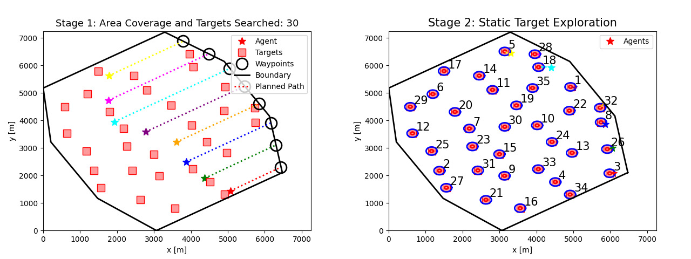

# 复杂海域下多智能体协同探查技术研究

## 第十八届“挑战杯”全国大学生课外学术科技作品竞赛“揭榜挂帅”专项赛，全国一等奖

## 介绍 
海洋环境复杂且不断变化，这使得传统平台探测的准确性较低。为了提高准确性和降低安全风险，我们可以使用近距离观察和智能代理来探索指定的复杂海域。 在此任务中，参与者必须使用多智能体动态编程来覆盖不规则的封闭海域。每个智能代理必须在保持安全导航的同时，探索整个区域和所有静态目标。 为了探索静态目标，智能代理的探索次数和探索角度在实时地动态调整。软件算法模型必须执行动态分配和计划以确保完全覆盖整个区域。 通过有效的探索，检测负载可以获取静态目标的高精度位置、速度、图像或视频信息，同时破坏全覆盖路线规划。
 
## 安装和运行 
### 1. 克隆这个仓库 
```shell
 git clone --depth 1 https://github.com/Gaochengzhi/MACM.git
```
### 2. 如果你想运行 Matlab 代码
Matlab 版本代码使用 [GCAA](https://github.com/MartinBraquet/task-allocation-auctions) 优化器，位于 ./matlab_code.

要运行，只需执行主函数：
```matlab
coverage_competition_main_json.m % 主函数入口
```

### 3. 如果你想运行 Python 代码
Python 代码使用 scipy.optimize 中的 linear_sum_assignment ，利用匈牙利算法为代理分配目标要安装包并运行它，在 Unix 兼容环境中简单地执行以下命令。
```shell
pip3 install -r requirements.txt
python3 test_main.py 
```

## 修改参数

预设的测试参数定义在 `src/getFakeTarget.py` 和 `src/getInitTaskInfo`中，并提供了两个版本`getInitTaskInfo1` 和 `getInitTaskInfo`

可以自由定制修改区域边界和禁航区顶点的参数和目标属性。
